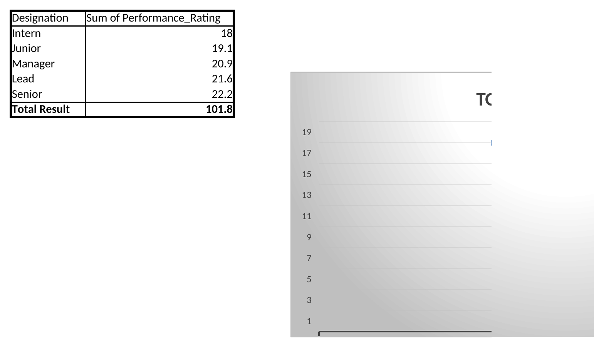
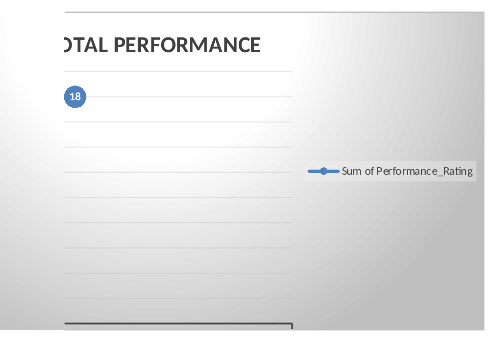
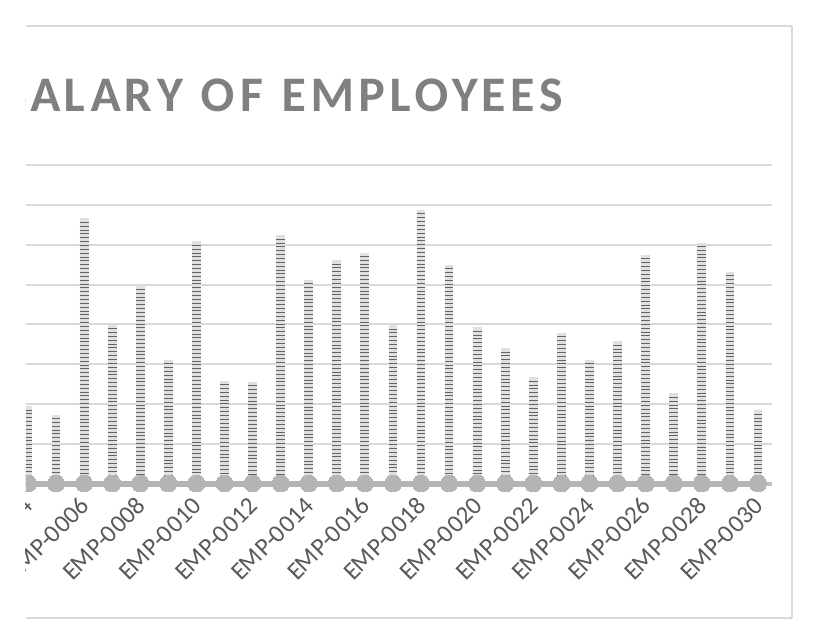
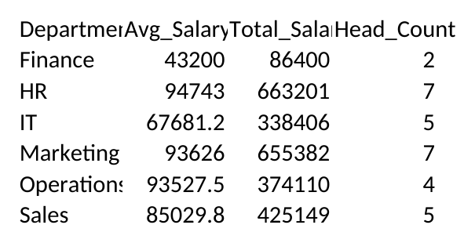

# 📊 HRInsight 360 - Employee Performance & Salary Analytics Dashboard


## 🚀 Project Overview

**HRInsight 360** is an interactive **HR Analytics Dashboard** developed using Microsoft Excel to analyze employee performance, salary distribution, workforce trends, and department-level insights.

The project transforms raw employee data into meaningful business intelligence reports using **PivotTables, PivotCharts, slicers, and advanced Excel analytics techniques**.

This dashboard helps HR teams and management make data-driven decisions related to employee performance, compensation analysis, and workforce planning.


---

# 🎯 Business Objective

The main objective of this project is to:

✔ Analyze employee performance trends  
✔ Compare salary distribution across departments  
✔ Track workforce strength and active employees  
✔ Identify top-performing roles and departments  
✔ Convert raw HR data into actionable insights  


---

# 📊 Dashboard Preview


## ⭐ Designation-wise Performance Analysis




## 🏢 Department-wise Performance Overview




## 💰 Employee Salary Distribution




## 📈 Department KPI Summary




---

# ✨ Key Features

### 📌 Interactive HR Dashboard

- Dynamic Excel dashboard interface
- Real-time filtering using slicers
- Easy navigation between analysis views


### 📌 Employee Performance Analytics

Analyzes:

- Performance rating by designation
- Department performance comparison
- Employee-level productivity insights


### 📌 Salary Analytics

Tracks:

- Employee salary distribution
- Average salary by department
- Total compensation analysis
- Location-wise salary comparison


### 📌 Workforce Insights

Includes:

- Active employee count
- Department headcount
- Employee status monitoring


---

# 📂 Workbook Structure


| Sheet Name | Description |
|-----------|-------------|
| Employee_List | Raw employee dataset |
| SALARY DASHBOARD | Main analytics dashboard |
| TOTAL PERFORMANCE | Department performance analysis |
| PERFORMANCE RATING | Employee performance insights |
| LOCATION | Location-wise salary analytics |
| SALARY OF EMP | Individual employee salary report |
| COUNT ACTIVE | Active employee tracking |
| Department_Summary | Department KPIs |


---

# 🛠️ Tools & Technologies


| Technology | Usage |
|-----------|-------|
| Microsoft Excel | Dashboard Development |
| Pivot Tables | Data Summarization |
| Pivot Charts | Data Visualization |
| Slicers | Interactive Filtering |
| Excel Functions | Data Processing |
| Data Cleaning | Data Preparation |


---

# 📈 Data Analytics Workflow


Raw Employee Data

⬇️

Data Cleaning & Formatting

⬇️

Pivot Table Analysis

⬇️

Dashboard Development

⬇️

Business Insight Generation


---

# 📁 Repository Structure


```
HRInsight-360-Employee-Analytics/

│

├── Dataset/

│   └── Employee_Performance_Salary_Dashboard.xlsx

│

├── screenshots/

│   ├── 01_designation_wise_performance.png

│   ├── 02_department_wise_performance.png

│   ├── 03_salary_by_employee.png

│   └── 04_department_summary.png

│

└── README.md

```


---

# 💡 Key Insights Generated


The dashboard provides insights about:

📌 Which department performs best  
📌 Salary comparison among employees  
📌 Workforce distribution  
📌 Employee performance patterns  
📌 Department-level business metrics  


---

# 🎯 Skills Demonstrated


- Data Analytics
- HR Analytics
- Business Intelligence
- Dashboard Development
- Data Visualization
- KPI Reporting
- Excel Automation
- Analytical Thinking


---

# 🚀 Future Enhancements


🔹 Power BI dashboard version  
🔹 Employee attrition prediction using Machine Learning  
🔹 AI-based salary prediction model  
🔹 Automated HR reporting system  


---

# 👨‍💻 Developer


**Lalith Krish**

B.Tech Artificial Intelligence & Data Science  
Velalar College of Engineering and Technology


🔗 Connect with me on LinkedIn:  
https://www.linkedin.com/in/lalithkrish-data/


---

⭐ If you found this project useful, consider giving this repository a star!
